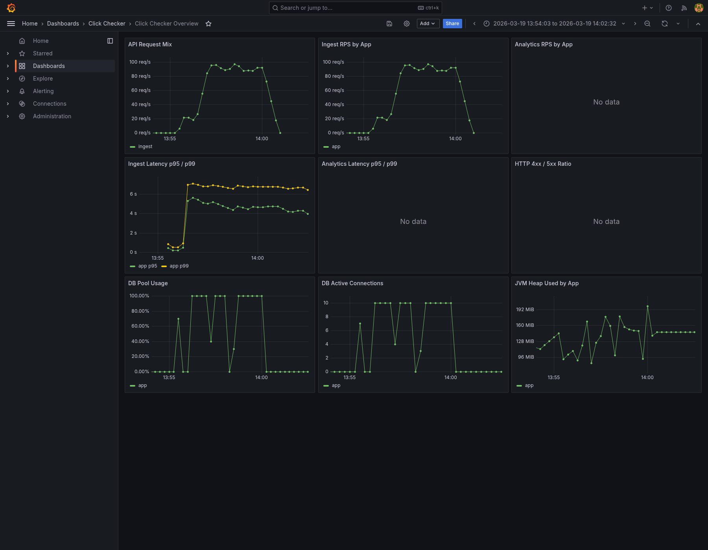
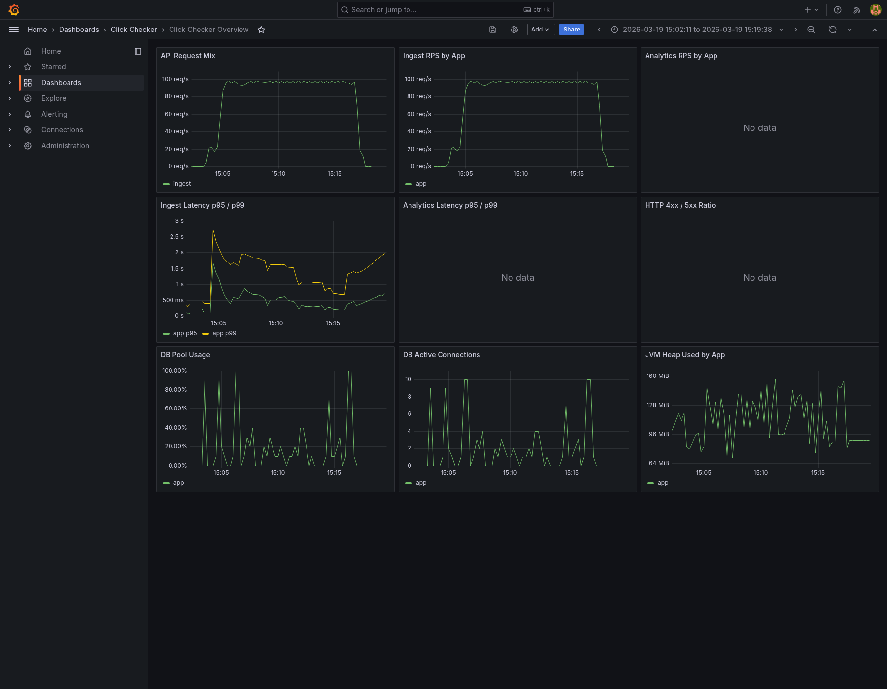

# 13. W1 1차 종합

## 문서 목적

`W1` 1차 사이클에서 확인한 write baseline, 1차 개선, 재검증 결과를 한 문서로 정리한다.  
이번 문서는 run 상세 수치를 다시 나열하는 데 목적이 있지 않고, `W1`를 여기서 왜 1차 종료로 보고 다음 단계로 넘기는지 정리하는 데 목적이 있다.

## 1. 작업 배경

성능 개선 단계의 첫 공식 시나리오는 `POST /api/events` write path를 기준으로 잡았다.

이유는 다음과 같다.

- 이전 경량 검증에서 write가 read보다 먼저 무거워 보이는 신호가 있었다.
- 이벤트 수집 경로는 이후 funnel, retention, users overview의 입력 원천이라 먼저 안정성을 확인할 가치가 있었다.
- read나 mixed보다 원인 분리가 쉬웠다.

즉 `W1`는 실서비스 전체를 재현하려는 시나리오가 아니라, write 경로의 첫 기준선을 설명 가능하게 만드는 시나리오로 시작했다.

## 2. 이번에 실제로 한 일

이번 `W1` 1차 사이클에서 실제로 진행한 항목은 다음과 같다.

- `r50` 공식 baseline 확보
- `r100` baseline으로 첫 한계 구간 확인
- write 앞단 비용 1차 절감
  - `apiKeyLastUsedAt` 매요청 저장 완화
  - organization 재조회 제거
- 같은 조건으로 `r50`, `r100` 재검증
- `r200` 짧은 probe로 새 한계 구간 확인
- `existing 100 / new 0`, `existing 50 / new 50` 비교 probe로 사용자 비율 영향 확인

상세 run 기록은 [04-대규모-부하-테스트-기록.md](04-대규모-부하-테스트-기록.md), 적용한 변경은 [06-성능-개선-조치-이력.md](06-성능-개선-조치-이력.md)를 기준으로 본다.

## 3. 핵심 결과

이번 사이클에서 확인한 핵심 결과는 아래와 같다.

- `50 RPS`는 안정 구간으로 볼 수 있다.
- 첫 `100 RPS`는 local 기준 한계 구간처럼 보였지만, 앞단 비용을 줄인 뒤에는 통과 구간으로 이동했다.
- `200 RPS`는 여전히 한계 구간이다.
- 신규 user 생성은 비용을 더 키우지만, 유일한 원인은 아니다.

즉 이번 사이클은 "`100 RPS`가 왜 무거웠는가"를 앞단 비용 기준으로 먼저 정리하고, 그 효과를 실제 재검증으로 확인한 단계라고 볼 수 있다.

### `r100` 전후 비교

초기 `r100` baseline은 local 기준 한계 구간에 가까웠다.  
앞단 비용을 줄인 뒤 같은 `100 RPS`는 통과 구간으로 이동했다.

**초기 `r100` baseline**

**앞단 비용 절감 후 `r100` 재검증**

## 4. 이번에 확인한 구조적 해석

이번 단계에서 가장 중요하게 확인한 점은 다음 두 가지다.

### 4.1 앞단 비용은 작아 보여도 실제 영향이 컸다

첫 `r100`에서는 event insert 자체보다도 아래 비용이 먼저 눈에 띄었다.

- 같은 org row에 대한 `apiKeyLastUsedAt` 반복 update
- 이미 인증한 org에 대한 서비스 내부 재조회

이 두 비용을 줄이자 `r50`, `r100`이 모두 크게 개선됐다.  
즉 write 경로는 전체 구조가 무너진 상태라기보다, 앞단의 작은 반복 비용이 먼저 한계 구간을 만들고 있던 상태에 가까웠다.

### 4.2 남은 비용은 `event_user + event` write 본체 쪽이다

`r200`과 사용자 비율 비교 probe를 통해, 현재 남은 비용은 느린 `users` 조회 쿼리라기보다 아래에 더 가깝다는 점이 드러났다.

- `event_user` 조회/생성
- `event` 저장

즉 지금 단계의 남은 문제는 불필요한 부가 작업보다는, 사용자 단위 분석 요구와 연결된 write 본체 작업의 구조적 비용에 가깝다.

## 5. 이번 단계에서 하지 않은 것

이번 `W1` 1차 사이클에서는 아래 항목을 일부러 바로 건드리지 않았다.

- `event_user` 구조 단순화
- batch insert
- raw / 후처리 분리
- Redis
- rollup / retention
- read / mixed 시나리오 최적화
- prod direct / prod public 성능 검증

이유는 현재 남은 `event_user` 비용이 funnel, retention, users overview 같은 사용자 단위 분석 기능과 직접 연결되어 있기 때문이다.  
즉시 제거 대상으로 보기보다, read와 mixed까지 본 뒤 구조 개선 우선순위를 다시 비교하는 쪽이 더 타당하다고 판단했다.

## 6. W1 1차 종료 판단

이번 단계까지의 결과를 기준으로, `W1`는 여기서 1차 종료로 본다.

종료 판단 이유는 다음과 같다.

- write baseline과 재검증이 충분히 확보됐다.
- 첫 번째로 줄일 만한 앞단 비용은 실제로 줄였고, 효과도 확인했다.
- `r200`와 사용자 비율 비교까지 통해 남은 비용의 성격도 대략 드러났다.
- 지금 시점에서 더 깊게 파고드는 것보다, read(`R1/R2/R3`)와 mixed(`M1`) 결과를 본 뒤 전체 개선 우선순위를 다시 잡는 편이 더 낫다.

즉 `W1`는 "아직 더 볼 것이 남아 있지만, 지금 당장 더 파기보다 다음 시나리오로 넘어갈 충분한 근거를 확보한 상태"로 정리한다.

## 7. 다음 단계

다음 단계는 write를 더 미세하게 다듬는 것이 아니라, 전체 병목 지도를 넓히는 쪽으로 잡는다.

- `R1 / R2 / R3` read baseline
- `M1` mixed baseline
- 그 뒤 write / read / mixed를 함께 보고 구조 개선 우선순위 재판단

즉 다음 사이클의 질문은 "write만 더 빠르게 할 수 있는가"가 아니라, "전체 시스템에서 무엇을 먼저 구조적으로 바꿔야 하는가"에 더 가깝다.

## 결론

`W1` 1차는 단순 baseline 확보를 넘어서, write 경로의 첫 병목을 확인하고 작은 개선으로 higher-rate 구간을 실제로 밀어낸 단계였다.  
동시에 `event_user` 구조 비용은 성급히 없애기보다 read / mixed 결과까지 본 뒤 다시 판단해야 할 구조적 trade-off라는 점도 함께 확인했다.

따라서 이번 문서의 결론은 다음 한 줄로 정리할 수 있다.

> `W1`는 1차 종료로 보고, 다음은 read와 mixed를 확인한 뒤 write 구조 개선을 다시 여는 것이 맞다.
