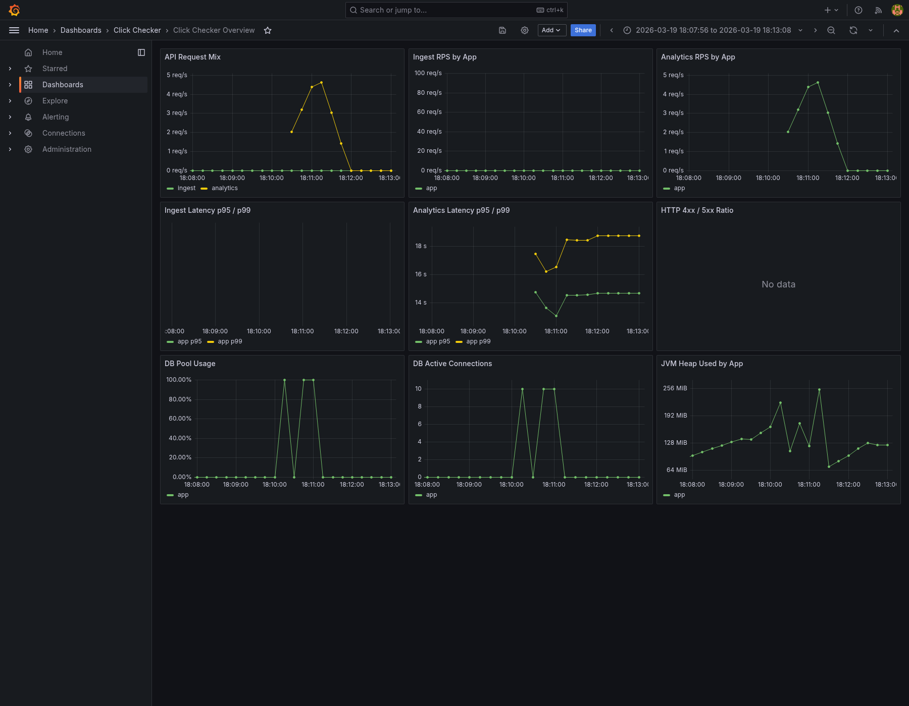
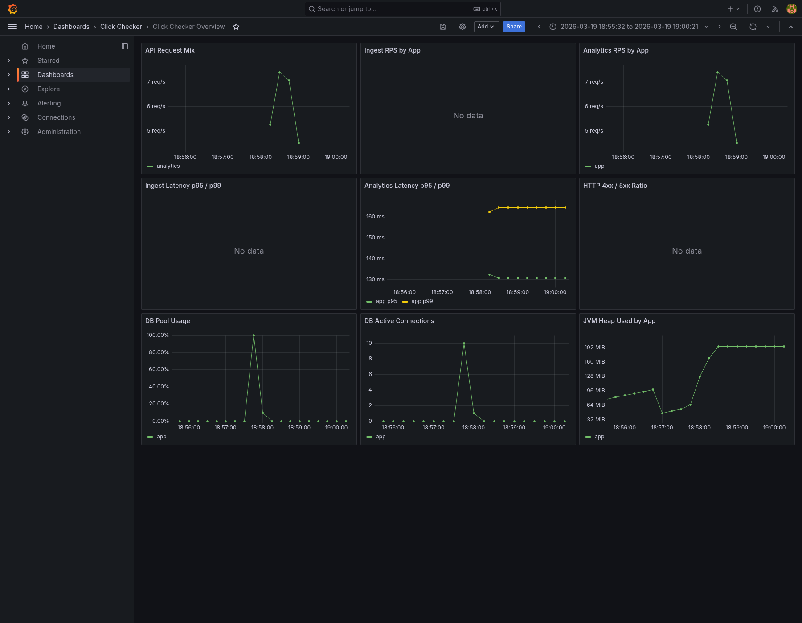
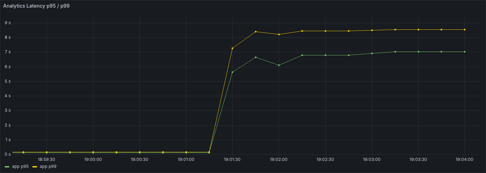
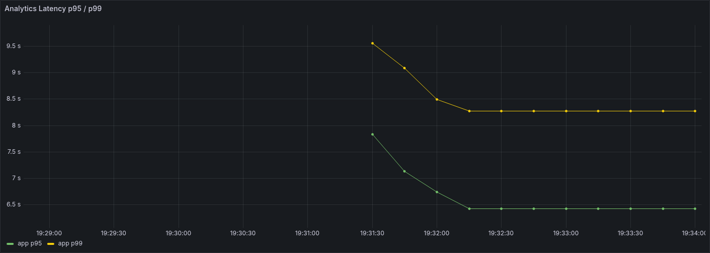

# 16. R1 1차 종합

## 문서 목적

`R1` 1차 사이클에서 확인한 overview read baseline, 첫 인덱스 적용, overview 집계 재사용 리팩터링 결과를 한 문서로 정리한다.  
이번 문서는 run 상세 수치를 다시 나열하는 데 목적이 있지 않고, `R1`를 여기서 왜 1차 정리로 보고 다음 단계로 넘기는지 정리하는 데 목적이 있다.

## 1. 작업 배경

`R1`은 read-heavy 단계의 첫 공식 시나리오로 `GET /api/v1/events/analytics/aggregates/overview`를 기준으로 잡았다.

이유는 다음과 같다.

- overview는 단일 count API가 아니라 count, distinct, group-by, route/event type 후처리가 섞인 대표 read였다.
- `paths`나 `time-buckets`보다 첫 read baseline으로 해석하기 쉬웠다.
- `W1` 이후 read 병목을 설명 가능한 형태로 처음 잡기 좋았다.

즉 `R1`은 "가장 무거운 read"를 바로 때리는 단계가 아니라, **대표 overview read가 어느 구간에서부터 무거워지는지 보는 첫 기준선 시나리오**로 시작했다.

## 2. 이번에 실제로 한 일

이번 `R1` 1차 사이클에서 실제로 진행한 항목은 다음과 같다.

- read 전용 dataset org와 고정 query window 준비
- `r10` 초기 dryrun으로 첫 read baseline 시도
- `events (organization_id, occurred_at)` 인덱스 추가
- 같은 dataset, 같은 query window로 `r10` 재검증
- 같은 인덱스 상태에서 `r30` 실행
- overview 내부 raw path/raw event type 집계 재사용 리팩터링
- 같은 `r30` 조건으로 재검증

상세 run 기록은 [04-대규모-부하-테스트-기록.md](04-대규모-부하-테스트-기록.md), 적용한 변경은 [06-성능-개선-조치-이력.md](06-성능-개선-조치-이력.md)를 기준으로 본다.

## 3. 핵심 결과

이번 사이클에서 확인한 핵심 결과는 아래와 같다.

- 첫 `r10`은 예상보다 훨씬 무거웠고, overview read가 단순한 요약 API가 아니라는 점이 드러났다.
- 첫 공통 인덱스 하나로 `r10`은 failure 구간에서 안정 구간으로 이동했다.
- 하지만 `r30`은 아직 한계 구간이었다.
- overview 내부 raw path/raw event type 집계 재사용 리팩터링은 실제 효과가 있었지만, `r30`를 통과 구간으로 옮기기엔 아직 부족했다.

즉 이번 사이클은 "`overview read가 왜 벌써 무거운가`"를 먼저 분해하고, **첫 인덱스와 구조 재사용 리팩터링이 어느 정도까지 효과가 있는지 확인한 단계**라고 볼 수 있다.

### `r10` 전후 비교

초기 `r10`은 local 기준으로도 실패했다.  
첫 공통 인덱스 적용 뒤 같은 `10 RPS`는 안정 구간으로 이동했다.

**초기 `r10` baseline fail**

**첫 인덱스 적용 후 `r10` 재검증**

### `r30` 전후 비교

첫 인덱스 적용 뒤에도 `r30`은 아직 한계 구간이었다.  
overview 내부 raw 집계 재사용 뒤 일부 개선됐지만 threshold는 아직 넘지 못했다.

**첫 인덱스 적용 후 `r30`**

**overview 집계 재사용 후 `r30` 재검증**

## 4. 이번에 확인한 구조적 해석

이번 단계에서 가장 중요하게 확인한 점은 다음 세 가지다.

### 4.1 첫 번째로 큰 원인은 공통 범위 읽기 비용이었다

첫 `R1 r10`은 `10 RPS`에서도 `p95 14.98s` 수준으로 실패했다.  
그런데 `events (organization_id, occurred_at)` 인덱스 하나만으로 같은 `r10`은 `p95 130.84ms` 수준의 안정 구간으로 이동했다.

즉 초기 failure의 가장 큰 원인은 overview 조립 함수 자체보다도, **공통 범위 읽기 비용**에 더 가까웠다.

### 4.2 `countDistinct(event_user_id)`는 현재 dataset에선 1순위 병목이 아니었다

실제 query window 기준 EXPLAIN을 보면 다음 정도였다.

- `count(id)`: 약 `5.15ms`
- `count(distinct event_user_id)`: 약 `4.66ms`
- `path group by`: 약 `8.57ms`
- `event type group by`: 약 `5.76ms`

즉 현재 dataset 규모에서는 `countDistinct(event_user_id)` 자체가 압도적으로 무거운 쿼리라고 보긴 어려웠다.

### 4.3 남은 비용은 overview 내부 조합 구조 쪽이다

첫 인덱스 적용 뒤 `r30`이 여전히 실패했고, raw path/raw event type 집계 재사용 리팩터링 뒤에야 `p95 6.52s -> 5.09s`, `dropped_iterations 66 -> 40`으로 줄었다.

즉 현재 남은 문제는 단일 쿼리 하나보다, **overview가 여러 집계를 한 요청 안에서 조합하는 구조적 비용**에 더 가깝다.

## 5. 이번 단계에서 하지 않은 것

이번 `R1` 1차 사이클에서는 아래 항목을 일부러 바로 건드리지 않았다.

- 두 번째 인덱스 추가
  - 예: `(organization_id, occurred_at, event_user_id)`, `(organization_id, occurred_at, path)`
- route template / event type mapping 캐시
- overview를 넘는 더 큰 read 구조 변경
- `R2`, `R3`, `M1` 결과를 보기 전의 성급한 read 전용 최적화 확대
- prod direct / prod public read 검증

이유는 첫 인덱스 하나와 overview 구조 재사용만으로도 이미 큰 흐름이 보였고, 추가 인덱스는 write 부담을 다시 늘릴 수 있기 때문이다.  
즉 지금 단계에서는 **더 넣기보다, 어디까지가 첫 개선의 효과였는지 정리하는 편**이 더 타당하다고 판단했다.

## 6. R1 1차 종료 판단

이번 단계까지의 결과를 기준으로, `R1`는 여기서 1차 종료로 본다.

종료 판단 이유는 다음과 같다.

- read dataset과 실행 구조가 문서/스크립트 기준으로 정리됐다.
- 첫 `r10` failure의 원인 축이 공통 범위 읽기 비용이라는 점이 확인됐다.
- 첫 공통 인덱스는 실제로 큰 효과를 냈고, `W1` write 회귀도 만들지 않았다.
- overview 내부 중복 제거도 실제 효과가 있음을 확인했다.
- 그럼에도 `r30`은 아직 실패 구간이므로, 지금 단계에서 추가 인덱스를 더 넣기보다 다음 read 시나리오로 넘어가 전체 read 병목 지도를 넓히는 편이 더 낫다.

즉 `R1`는 "아직 더 볼 것이 남아 있지만, overview read의 1차 병목과 첫 개선 효과를 충분히 설명할 수 있는 상태"로 정리한다.

## 7. 다음 단계

다음 단계는 `R1`만 더 미세하게 다듬는 것이 아니라, read 축 전체를 넓혀보는 쪽으로 잡는다.

- `R2`에서 path/group-by 성격 분리
- `R3`에서 time-bucket/trend 성격 분리
- 이후 `M1` mixed baseline으로 write/read shared resource 경쟁 확인
- 그 뒤 write/read/mixed를 함께 보고 구조 개선 우선순위 재판단

즉 다음 사이클의 질문은 "overview를 조금 더 빠르게 만들 수 있는가"가 아니라, **"read 전체에서 어떤 축이 먼저 구조적으로 무거운가"**에 더 가깝다.

## 결론

`R1` 1차는 overview read가 단순 요약 API가 아니라는 점을 확인하고, 첫 공통 인덱스와 overview 집계 재사용 리팩터링이 각각 어디까지 효과가 있는지 실제로 검증한 단계였다.  
동시에 `30 RPS`는 아직 한계 구간이라는 점도 명확히 남겨, 다음 단계에서 `R2`, `R3`, `M1`을 함께 보고 구조 개선 우선순위를 다시 잡아야 할 근거를 확보했다.

따라서 이번 문서의 결론은 다음 한 줄로 정리할 수 있다.

> `R1`는 1차 종료로 보고, 다음은 `R2/R3/M1`을 확인한 뒤 read 구조 개선을 다시 여는 것이 맞다.
