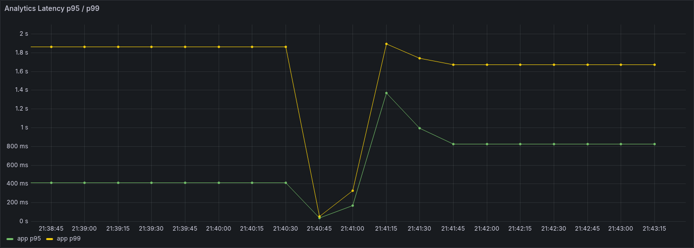
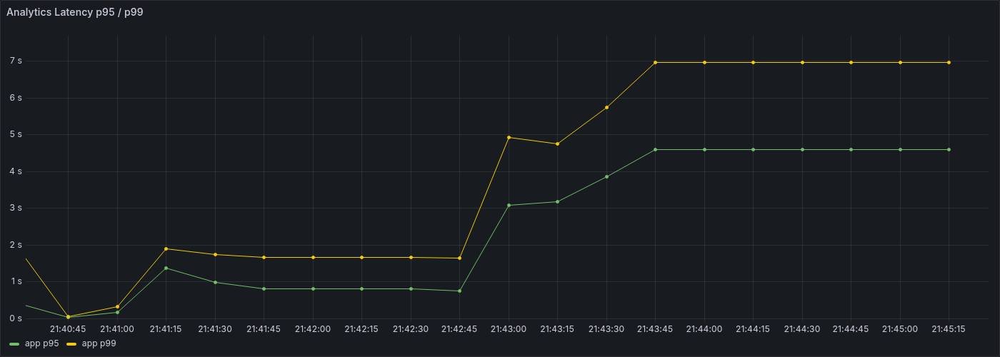

# 19. R2 1차 종합

## 문서 목적

`R2` 1차 사이클에서 확인한 route 집계 read baseline과 한계 구간을 한 문서로 정리한다.  
이번 문서는 run 상세 수치를 다시 나열하는 데 목적이 있지 않고, `R2`를 여기서 왜 1차 정리로 보고 다음 단계로 넘기는지 정리하는 데 목적이 있다.

## 1. 작업 배경

`R2`는 read-heavy 단계에서 집계형 read를 대표하는 시나리오로 `GET /api/v1/events/analytics/aggregates/routes`를 기준으로 잡았다.

이유는 다음과 같다.

- `R1` overview는 복합 요약 read였고, 다음에는 group-by / sort / topN 성격을 분리해서 볼 필요가 있었다.
- `paths`보다 `routes`가 현재 제품의 확장 중심 API에 더 가깝다.
- `routes`는 raw path를 routeKey로 재집계하는 구조라, 집계형 read의 비용을 설명하기 좋았다.

즉 `R2`는 **overview보다 한 축이 분리된 집계형 read가 어느 구간부터 무거워지는지 보는 첫 기준선 시나리오**로 시작했다.

## 2. 이번에 실제로 한 일

이번 `R2` 1차 사이클에서 실제로 진행한 항목은 다음과 같다.

- `R1` read datasetVersion `r1-v1` 재사용
- 고정 `7일` query window, `top=10` query preset 확정
- `r10` 초기 baseline 실행
- 같은 dataset, 같은 query preset으로 `r30` 실행
- 같은 조건으로 `r50` 실행

상세 run 기록은 [04-대규모-부하-테스트-기록.md](04-대규모-부하-테스트-기록.md)를 기준으로 본다.

## 3. 핵심 결과

이번 사이클에서 확인한 핵심 결과는 아래와 같다.

- `R2 routes`는 `R1 overview`보다 훨씬 가벼웠다.
- `10 RPS`와 `30 RPS`는 모두 안정 구간이었다.
- `50 RPS`에서는 threshold fail이 발생했고, local 기준 한계 구간이 `30과 50 사이`로 좁혀졌다.
- 즉 집계형 read는 요약형 read보다 분명 가볍지만, group-by / sort / topN 비용이 완전히 공짜는 아니라는 점이 확인됐다.

### `r30` 안정 구간

같은 datasetVersion과 고정 `7일` query window에서 `30 RPS`는 충분히 안정 구간이었다.

### `r50` 한계 구간

같은 조건에서 `50 RPS`로 올리면 threshold fail이 발생했다.

## 4. 이번에 확인한 구조적 해석

이번 단계에서 가장 중요하게 확인한 점은 다음 두 가지다.

### 4.1 집계형 read는 overview보다 훨씬 가볍다

`R1 overview`는 `10 RPS` 초기 dryrun부터 실패했고, 첫 인덱스와 구조 재사용 리팩터링이 필요했다.  
반면 `R2 routes`는 같은 read dataset을 재사용했는데도 `10 RPS`, `30 RPS` 모두 안정 구간이었다.

즉 read라고 다 같은 read가 아니라,

- overview 같은 복합 요약 read
- routes 같은 집계형 read

사이에 비용 차이가 분명히 존재한다는 점이 확인됐다.

### 4.2 `routes`도 한계는 있다

`R2 r50`에서 아래 신호가 동시에 나타났다.

- `p95 = 5.98s`
- `p99 = 8.65s`
- `dropped_iterations = 119`
- `vus max = 181`

즉 `routes` 집계 read는 overview보다는 훨씬 가볍지만, `50 RPS`에서는 local 기준 한계 구간에 들어간다.  
이건 routeKey 기준 재집계, 정렬, 상위 N 계산 비용이 동시 부하에서 누적된 결과로 보는 게 자연스럽다.

## 5. 이번 단계에서 하지 않은 것

이번 `R2` 1차 사이클에서는 아래 항목을 일부러 바로 건드리지 않았다.

- `routes` 전용 추가 인덱스
- route 집계 전용 캐시
- routeKey 사전 계산 저장
- `paths`, `routes/unmatched-paths`, `routes/unique-users` 추가 최적화
- prod direct / prod public 검증

이유는 현재 단계의 목적이 `R2` 자체를 미세 최적화하는 데 있지 않고, **집계형 read의 baseline과 한계 구간을 먼저 확보하는 데** 있기 때문이다.

## 6. R2 1차 종료 판단

이번 단계까지의 결과를 기준으로, `R2`는 여기서 1차 종료로 본다.

종료 판단 이유는 다음과 같다.

- `R2` 시나리오 문서와 prepare/run 구조가 정리됐다.
- `R1` datasetVersion 재사용 기준이 실제로 동작한다.
- `10 RPS`, `30 RPS`, `50 RPS`에서 route 집계 read의 안정 구간과 한계 구간이 분명하게 나왔다.
- `R2`가 `R1`보다 훨씬 가볍다는 점과, 그럼에도 `50 RPS`에서는 실패한다는 점을 설명할 수 있게 됐다.

즉 `R2`는 "집계형 read의 대표 구간을 충분히 설명할 수 있는 상태"로 정리한다.

## 7. 다음 단계

다음 단계는 `R2`를 더 파기보다 read 축을 한 번 더 넓히는 쪽으로 잡는다.

- `R3`에서 time-bucket / trend 성격 분리
- 이후 `M1` mixed baseline으로 write/read shared resource 경쟁 확인
- 그 뒤 write/read/mixed를 함께 보고 구조 개선 우선순위 재판단

즉 다음 질문은 "`routes`를 조금 더 빠르게 만들 수 있는가"가 아니라, **"집계형 read 다음으로 어떤 read 축이 더 먼저 구조적으로 무거운가"**에 더 가깝다.

## 결론

`R2` 1차는 route 집계 read가 overview보다 훨씬 가볍다는 점과, local 기준 한계 구간이 `30과 50 사이`라는 점을 확인한 단계였다.  
동시에 read 종류별 비용 차이를 더 분명하게 만들어, 다음 단계에서 `R3`, `M1`을 통해 전체 read/mixed 병목 지도를 넓혀야 할 근거를 확보했다.

따라서 이번 문서의 결론은 다음 한 줄로 정리할 수 있다.

> `R2`는 1차 종료로 보고, 다음은 `R3`와 `M1`을 확인해 read 전체 축을 더 넓게 보는 것이 맞다.
