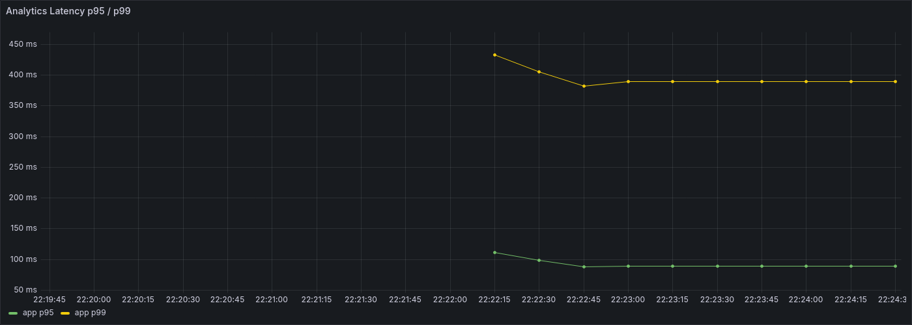
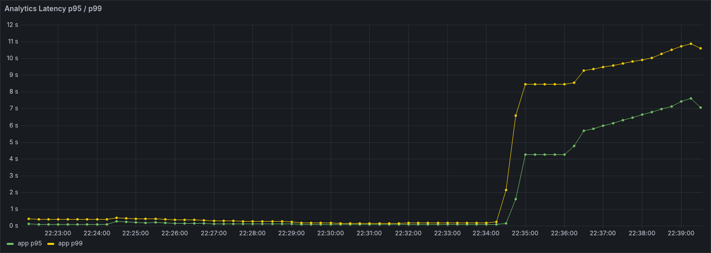

# 22. R3 1차 종합

## 문서 목적

`R3` 1차 사이클에서 확인한 time-buckets read baseline과 한계 구간을 한 문서로 정리한다.  
이번 문서는 run 상세 수치를 다시 나열하는 데 목적이 있지 않고, `R3`를 여기서 왜 1차 정리로 보고 다음 단계로 넘기는지 정리하는 데 목적이 있다.

## 1. 작업 배경

`R3`는 read-heavy 단계에서 추세형 read를 대표하는 시나리오로 `GET /api/v1/events/analytics/aggregates/time-buckets`를 기준으로 잡았다.

이유는 다음과 같다.

- `R1` overview는 복합 요약 read였고, `R2` routes는 group-by / sort / topN 성격의 집계형 read였다.
- 다음에는 시간축 bucket 조립 비용과 빈 bucket 채우기 비용을 분리해서 볼 필요가 있었다.
- `time-buckets`는 같은 datasetVersion을 재사용하면서도 집계형 read와 다른 비용 구조를 보여주기 좋았다.

즉 `R3`는 **요약형 read와 집계형 read 다음으로, 추세형 read가 어느 구간부터 무거워지는지 보는 첫 기준선 시나리오**로 시작했다.

## 2. 이번에 실제로 한 일

이번 `R3` 1차 사이클에서 실제로 진행한 항목은 다음과 같다.

- `R1` read datasetVersion `r1-v1` 재사용
- 고정 absolute `7일` query window, `bucket=HOUR`, `timezone=UTC` query preset 확정
- `bucket` enum 계약을 `HOUR` 기준으로 맞춘 뒤 `r10` 유효 baseline 실행
- 같은 dataset, 같은 query preset으로 `r30` 실행

상세 run 기록은 [04-대규모-부하-테스트-기록.md](04-대규모-부하-테스트-기록.md)를 기준으로 본다.

## 3. 핵심 결과

이번 사이클에서 확인한 핵심 결과는 아래와 같다.

- `R3 time-buckets`는 `R1 overview`보다 훨씬 가볍고, `R2 routes`보다는 무거운 중간 축으로 나타났다.
- `10 RPS`는 안정 구간이었다.
- `30 RPS`에서는 threshold fail이 발생했고, local 기준 한계 구간이 `10과 30 사이`로 좁혀졌다.
- 즉 추세형 read는 routes 집계 read만큼 가볍지는 않고, hour bucket 조립 비용이 동시 부하에서 빠르게 커진다는 점이 확인됐다.

### `r10` 안정 구간

같은 datasetVersion과 고정 `7일/HOUR/UTC` query preset에서 `10 RPS`는 충분히 안정 구간이었다.

### `r30` 한계 구간

같은 조건에서 `30 RPS`로 올리면 threshold fail이 발생했다.

## 4. 이번에 확인한 구조적 해석

이번 단계에서 가장 중요하게 확인한 점은 다음 두 가지다.

### 4.1 추세형 read는 집계형 read보다 무겁다

`R2 routes`는 같은 datasetVersion 기준으로 `30 RPS`까지 안정 구간이었다.  
반면 `R3 time-buckets`는 `10 RPS`는 통과했지만 `30 RPS`에서 바로 threshold fail이 발생했다.

즉 read라고 다 같은 read가 아니라,

- `routes` 같은 집계형 read
- `time-buckets` 같은 추세형 read

사이에 비용 차이가 분명히 존재한다는 점이 확인됐다.

### 4.2 bucket 조립 비용은 동시 부하에서 빠르게 커진다

`R3 r30`에서 아래 신호가 동시에 나타났다.

- `p95 = 4.14s`
- `p99 = 7.99s`
- `dropped_iterations = 147`
- `vus max = 178`

즉 `time-buckets` read는 단순 count 응답이 아니라, hour bucket 기준 결과 조립과 빈 bucket 처리 비용이 겹치면서 `30 RPS`에서 local 기준 한계 구간에 들어간다.  
이건 `R1 overview`처럼 여러 요약 계산을 묶은 read만 무거운 것이 아니라, **추세형 read도 별도의 구조적 비용을 가진다**는 뜻에 가깝다.

## 5. 이번 단계에서 하지 않은 것

이번 `R3` 1차 사이클에서는 아래 항목을 일부러 바로 건드리지 않았다.

- `time-buckets` 전용 추가 인덱스
- bucket 결과 캐시
- `DAY` bucket 기준 재테스트
- `route-time-buckets`, `event-type-time-buckets` 확장 시나리오
- prod direct / prod public 검증

이유는 현재 단계의 목적이 `R3`를 미세 최적화하는 데 있지 않고, **추세형 read의 baseline과 한계 구간을 먼저 확보하는 데** 있기 때문이다.

## 6. R3 1차 종료 판단

이번 단계까지의 결과를 기준으로, `R3`는 여기서 1차 종료로 본다.

종료 판단 이유는 다음과 같다.

- `R3` 시나리오 문서와 prepare/run 구조가 정리됐다.
- `R1` datasetVersion 재사용 기준이 실제로 동작한다.
- `10 RPS`, `30 RPS`에서 time-buckets read의 안정 구간과 한계 구간이 분명하게 나왔다.
- `R3`가 `R2`보다 무겁고 `R1`보다는 가볍다는 점을 설명할 수 있게 됐다.

즉 `R3`는 "추세형 read의 대표 구간을 충분히 설명할 수 있는 상태"로 정리한다.

## 7. 다음 단계

다음 단계는 `R3`를 더 파기보다, write와 read를 같이 붙여보는 mixed 단계로 넘어가는 쪽으로 잡는다.

- `M1`에서 write/read shared resource 경쟁 확인
- 이후 write/read/mixed를 함께 보고 구조 개선 우선순위 재판단
- 그 뒤 local에서 잡은 패턴을 EC2 / prod direct 검증으로 확장

즉 다음 질문은 "`time-buckets`를 조금 더 빠르게 만들 수 있는가"가 아니라, **"write와 read가 함께 붙었을 때 어떤 축이 먼저 무너지는가"**에 더 가깝다.

## 결론

`R3` 1차는 추세형 read가 집계형 read보다 무겁고, local 기준 한계 구간이 `10과 30 사이`라는 점을 확인한 단계였다.  
동시에 read 종류별 비용 차이를 더 입체적으로 만들고, 다음 단계에서 `M1`을 통해 shared resource 경쟁을 봐야 할 근거를 확보했다.

따라서 이번 문서의 결론은 다음 한 줄로 정리할 수 있다.

> `R3`는 1차 종료로 보고, 다음은 `M1`을 확인해 write/read 경쟁 구간을 보는 것이 맞다.
