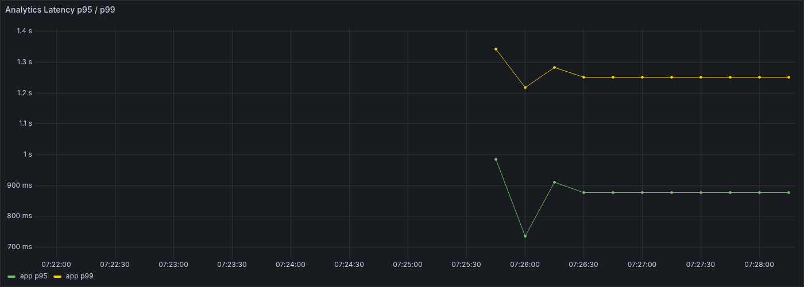
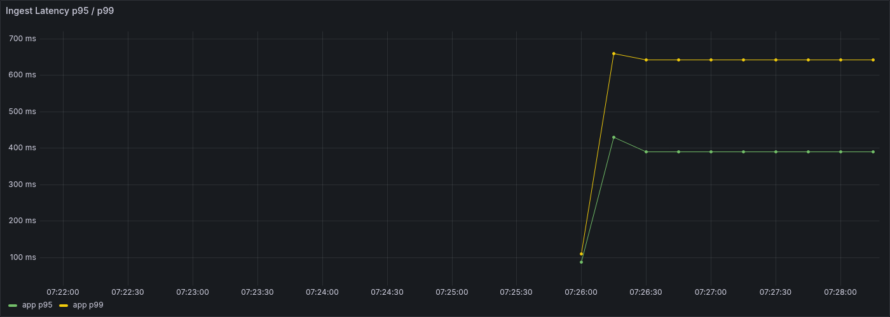
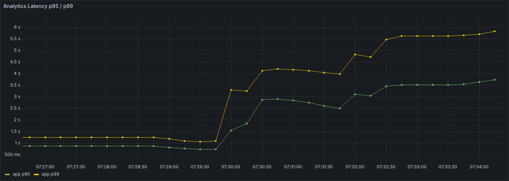
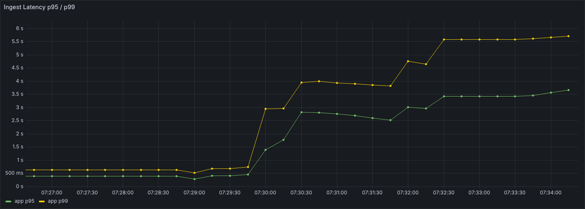

# 25. M1 1차 종합

## 문서 목적

`M1` 1차 사이클에서 확인한 mixed baseline과 한계 구간을 한 문서로 정리한다.  
이번 문서는 run 상세 수치를 다시 나열하는 데 목적이 있지 않고, `M1`을 여기서 왜 1차 정리로 보고 다음 단계로 넘기는지 정리하는 데 목적이 있다.

## 1. 작업 배경

`M1`은 write-heavy와 read-heavy를 따로 본 뒤, 두 축이 같은 org / 같은 DB 자원 위에서 동시에 붙을 때 어떤 구간부터 경쟁이 시작되는지 보기 위한 첫 mixed 시나리오로 잡았다.

이유는 다음과 같다.

- `W1`은 write-only였고, `R1`은 overview read-only였다.
- 각 축을 따로 볼 때의 한계 구간은 확인했지만, 실제 운영에 가까운 상황에서는 write와 read가 동시에 들어온다.
- 따라서 다음 단계에서는 성능 최적화 자체보다 **shared resource 경쟁이 어느 구간부터 발생하는지** 먼저 확인할 필요가 있었다.

즉 `M1`은 **write와 read가 같은 snapshot 상태에서 함께 붙을 때의 첫 mixed 기준선**으로 시작했다.

## 2. 이번에 실제로 한 일

이번 `M1` 1차 사이클에서 실제로 진행한 항목은 다음과 같다.

- mixed 전용 datasetVersion `m1-v1` 생성
- mixed 전용 snapshotVersion `m1-v1-snap1` 생성
- 같은 snapshot에서 시작하도록 run 전 restore 구조 확정
- `POST /api/events` + `GET /api/v1/events/analytics/aggregates/overview` 조합 고정
- write/read `50:50` 비율, `10/10` pair rate 첫 mixed baseline 실행
- 같은 snapshot 기준 `20/20` mixed run 실행

상세 run 기록은 [04-대규모-부하-테스트-기록.md](04-대규모-부하-테스트-기록.md)를 기준으로 본다.

## 3. 핵심 결과

이번 사이클에서 확인한 핵심 결과는 아래와 같다.

- `M1 10/10`은 안정 구간이었다.
- `M1 20/20`은 threshold fail이 발생했다.
- mixed에서는 read만 느려진 것이 아니라 write도 같이 느려졌다.
- 즉 local 기준 첫 mixed 한계 구간은 `10/10과 20/20 사이`로 보는 것이 자연스럽다.

### `w10/r10` mixed baseline

같은 snapshot에서 write/read를 50:50으로 붙인 `10/10` 구간은 충분히 안정적이었다.

**read latency**

**write latency**

### `w20/r20` mixed 한계 구간

같은 snapshot에서 `20/20`으로 올리면 read와 write가 함께 느려지며 threshold fail이 발생했다.

**read latency**

**write latency**

## 4. 이번에 확인한 구조적 해석

이번 단계에서 가장 중요하게 확인한 점은 다음 두 가지다.

### 4.1 mixed에서는 read와 write가 같이 느려진다

`M1 w20/r20`에서는 아래 신호가 동시에 나타났다.

- read `p95 = 3.78s`, `p99 = 5.87s`
- write `p95 = 3.79s`, `p99 = 6.61s`
- `dropped_iterations = 77`
- `vus max = 153`

즉 mixed 상태에서는 `overview` read만 느려지는 것이 아니라, **write도 같이 지연이 올라간다.**  
이건 read-only, write-only에서 보던 병목이 단순 합이 아니라 shared DB / connection / pool 경쟁으로 이어진다는 뜻에 가깝다.

### 4.2 첫 mixed 기준선은 `10/10`으로 충분하다

`M1 w10/r10`에서는 아래 신호가 함께 나타났다.

- `http_req_failed = 0%`
- read `p95 = 941ms`
- write `p95 = 468ms`
- `dropped_iterations = 0`
- `vus max = 40`

즉 첫 mixed baseline은 더 높은 pair rate를 억지로 쓰기보다, **같은 snapshot에서 안정적으로 재현 가능한 `10/10`을 기준점으로 잡는 것이 더 적절하다.**

## 5. 이번 단계에서 하지 않은 것

이번 `M1` 1차 사이클에서는 아래 항목을 일부러 바로 건드리지 않았다.

- `30/30` mixed run
- mixed 전용 추가 인덱스
- mixed 전용 캐시
- read query window를 live write 구간과 겹치게 만드는 확장 시나리오
- prod direct / prod public mixed 검증

이유는 현재 단계의 목적이 `M1` 자체를 미세 최적화하는 데 있지 않고, **첫 mixed baseline과 shared resource 경쟁 구간을 먼저 확보하는 데** 있기 때문이다.

## 6. M1 1차 종료 판단

이번 단계까지의 결과를 기준으로, `M1`은 여기서 1차 종료로 본다.

종료 판단 이유는 다음과 같다.

- `M1` 시나리오 문서와 prepare / restore / run 구조가 정리됐다.
- mixed 전용 dataset / snapshot restore 구조가 실제로 동작한다.
- `10/10`과 `20/20`에서 mixed 안정 구간과 한계 구간이 분명하게 나왔다.
- write와 read가 함께 느려지는 mixed 경쟁 구간을 설명할 수 있게 됐다.

즉 `M1`은 "첫 mixed 구간을 충분히 설명할 수 있는 상태"로 정리한다.

## 7. 다음 단계

다음 단계는 `M1`을 더 파기보다, 지금까지 확보한 write/read/mixed 결과를 한 번 모아서 전체 병목 지도를 정리하는 쪽으로 잡는다.

- `W1`, `R1`, `R2`, `R3`, `M1` 결과 종합
- low-risk 조치와 구조적 비용 구분
- 이후 local 패턴을 EC2 / prod direct 검증으로 확장

즉 다음 질문은 "`M1`을 조금 더 빠르게 만들 수 있는가"가 아니라, **"지금까지의 결과를 기준으로 어떤 축이 구조 개선 우선순위에서 가장 앞에 와야 하는가"**에 더 가깝다.

## 결론

`M1` 1차는 mixed 환경에서 `10/10`은 안정 구간이고, `20/20`부터는 write와 read가 함께 느려진다는 점을 확인한 단계였다.  
동시에 write-only나 read-only 결과만으로는 보이지 않던 shared resource 경쟁 구간을 드러내, 다음 단계에서 전체 병목 지도를 종합할 근거를 확보했다.

따라서 이번 문서의 결론은 다음 한 줄로 정리할 수 있다.

> `M1`은 1차 종료로 보고, 다음은 지금까지의 write/read/mixed 결과를 함께 묶어 전체 병목 지도를 정리하는 것이 맞다.
